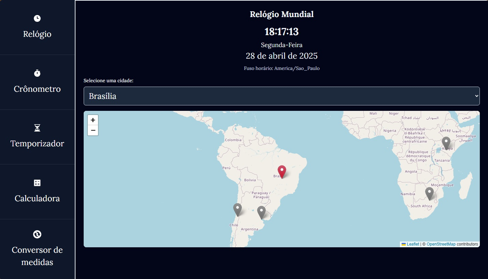
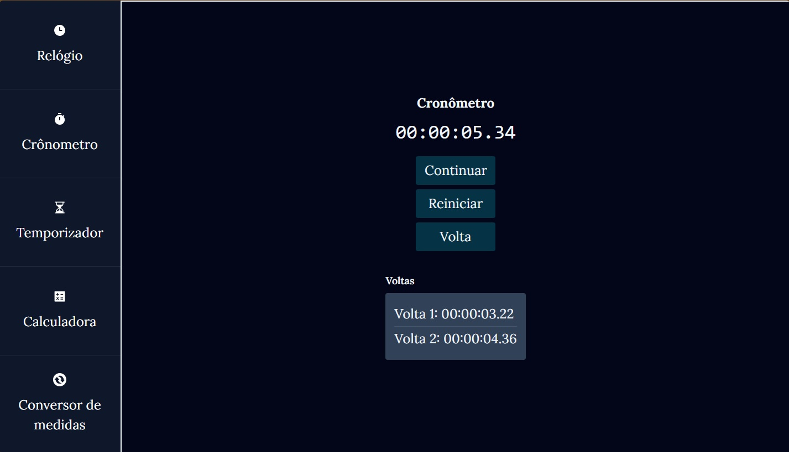
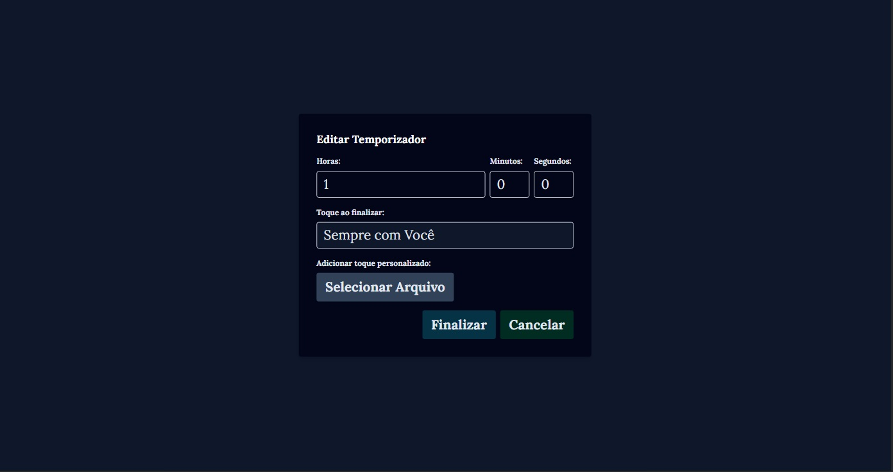
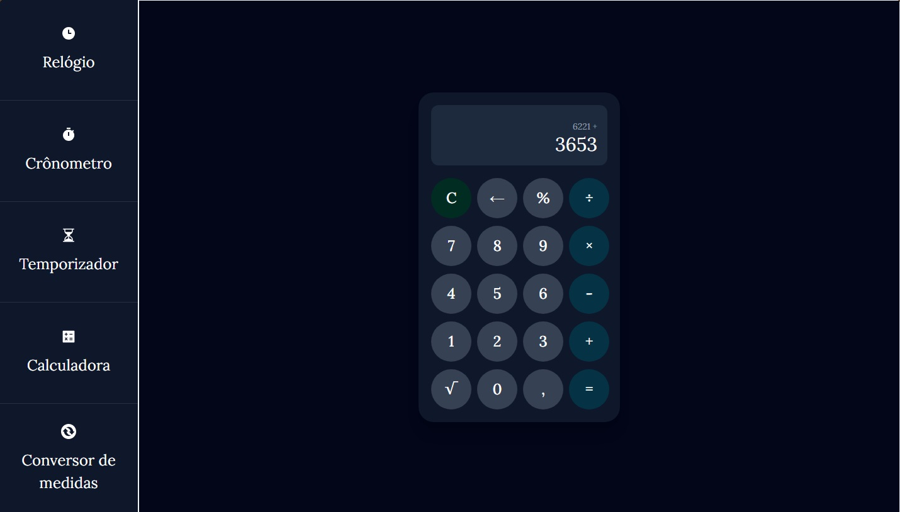
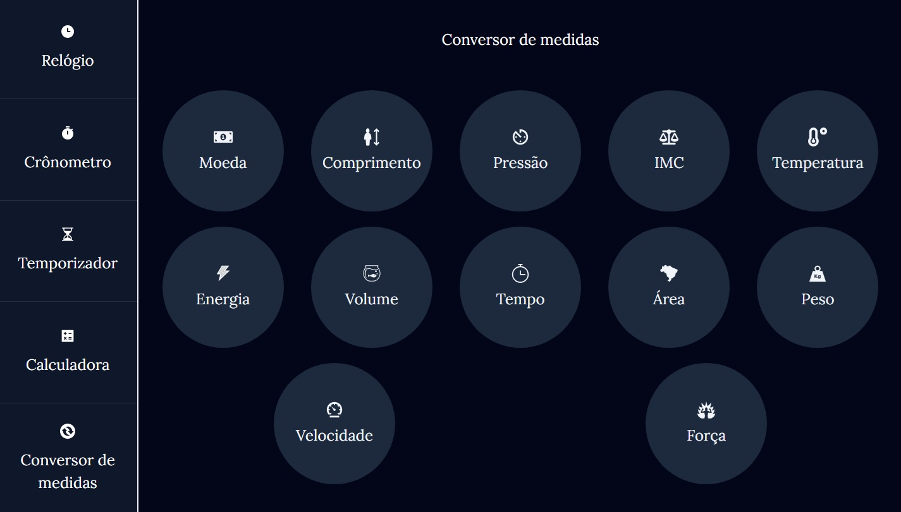
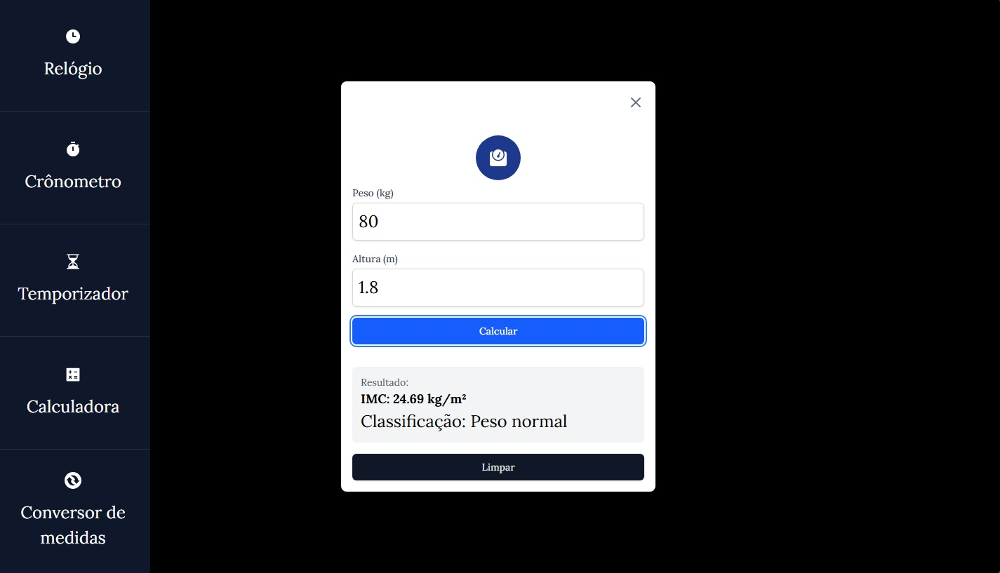
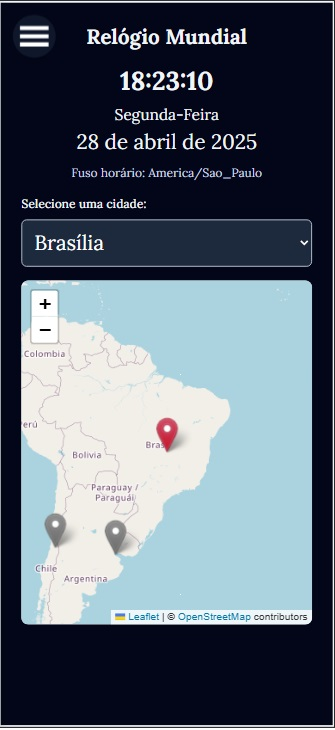
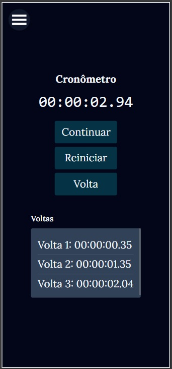
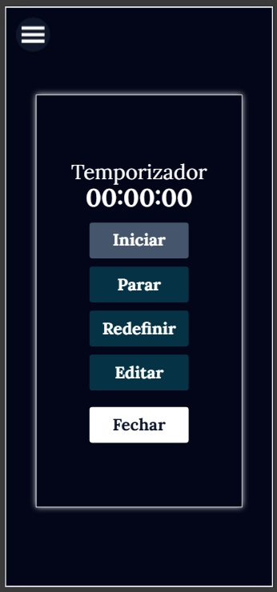
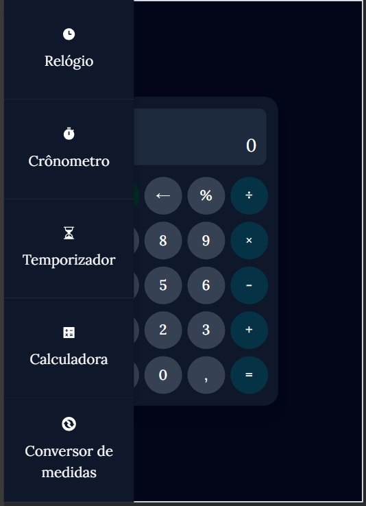

# Nome do Projeto
Chronos 


> Aplicação web com funcionalidades interativas para ajudar no dia a dia das pessoas. Contém relógio mundial, temporizador, conversor de medidas, calculadora e cronômetro.

## Sumário

- [Sobre o Projeto](#sobre-o-projeto)
- [Começando](#começando)
- [Pré-requisitos](#pré-requisitos)
- [Instalação](#instalação)
- [Uso](#uso)
- [Funcionalidades](#funcionalidades)
- [Tecnologias Utilizadas](#tecnologias-utilizadas)
- [Contribuição](#contribuição)
- [Licença](#licença)
- [Autor](#autor)
- [Agradecimentos](#agradecimentos)

## Sobre o projeto <a name="sobre-o-projeto"></a>

Este projeto foi desenvolvido utilizando linguagem typescript, framework Next.JS e Tailwind na estilização. Esta pronta para uso e segue as melhores práticas de desenvolvimento.

**Acesse o site**

https://chronos-clock.vercel.app/

## Começando <a name="começando"></a>

### Pré-requisitos <a name="pre-requisitos"></a>

Antes de iniciar , certifique-se acerca da instalação:

- Node.js v22.13.0 (versão utilizada no desenvolvimento do projeto → abril de 2025 )
- npm ou yarn

### Instalação <a name="instalação"></a>

Clone o repositório e instale as dependências:

```bash
git clone https://github.com/Talisson-matos/Chronos.git
cd seuprojeto
npm install 
```

## Uso <a name="uso"></a>

### Executar o projeto

***Para iniciar o projeto, basta rodar o seguinte comando:***

```bash
npm start
```
***Se estiver em ambiente de desenvolvimento, você pode rodar:***

```bash
npm run dev
```

### Executar o projeto com Docker

***Para rodar o projeto usando Docker, siga os passos abaixo:***

Certifique-se de que o Docker está instalado e funcionando no seu sistema. Você pode verificar isso com o comando:

 ```bash
docker --version
```

***Construa a imagem Docker do projeto:***

 ```bash
docker build -t seu_container .
```
***Execute o container:***

 ```bash
docker run -p 3000:3000 seu_container
```


## Layout & Funcionalidades <a name="funcionalidades"></a>

### Relógio Mundial

• Mostra o horário , dia da semana e data do ano;

• Funciona em diferentes fuso horários;

• Contém mapa interativo para ajudar o usuário na sua busca.





### Cronômetro

• Cronômetro com as funcionalidades de iniciar, parar, continuar, reiniciar e volta .



### Temporizador

• Temporizador de contagem regressiva com as funcionalidades de iniciar , parar , continuar, reiniciar e editar.


• Na parte de edição possibilita ao usuário definir o tempo, a música, ou até escolher um toque de seu computador.




### Calculadora

• Calculadora simples contendo operações de soma , subtração , multiplicação, divisão, raiz quadrada, porcentagem e operação com casas decimais.

• Pode ser tanto usada  pelo teclado do desktop/mobile ou pelos botões interativos do layout.




### Conversor de medidas

• Conversor contento operações de várias medidas, dentre elas:

♦ moeda

♦ comprimento 

♦ pressão

♦ IMC

♦ Temperatura

♦ Energia

♦ Volume

♦ Tempo

♦ Área

♦ Peso

♦ Velocidade

♦ Força



#### Exemplo do conversor de IMC:




### Menu responsivo para diferentes tamanhos de telas









**• Para mais interesses você pode baixar por aqui este vídeo ilustrativo da aplicação ou então acessá-lo pelo You Tube no link abaixo**


[](https://youtu.be/S7HvCfdf2Cg)

**• ou se preferir acesse o site**


## Tecnologias utilizadas <a name="tecnologias-utilizadas"></a>

- **Frontend:** Interface do usuário construída com React/Next.JS/Typescript.

- **Backend:** Roteamento com App Router.

- **Estilização:** Tailwind.

- **Containers:** Docker utilizado para conteinerização.

##  Contribuição

Ficamos felizes por querer contribuir! Siga os passos abaixo para participar do projeto.

###  Como contribuir <a name="contribuição"></a>

- Correções de bugs são sempre bem-vindas!

- Sinta-se livre para sugerir e implementar novas 
funcionalidades.

- Melhorias na documentação ajudam muito – qualquer atualização é válida.

###  Passos para contribuir

1. **Fork** este repositório e clone para sua máquina local → https://github.com/Talisson-matos/Chronos.git .

2. Crie uma nova **branch** para suas alterações: `git checkout -b minha-contribuicao`.

3. Faça as **modificações** necessárias e commit suas alterações: `git commit -m "Descrição breve da alteração"`.

4. Faça push da branch: `git push origin minha-contribuicao`.

5. Abra um **Pull Request** e aguarde a revisão da equipe.

###  Código de Conduta

Pedimos que todos os colaboradores respeitem nosso [📜 Código de Conduta](CODE_OF_CONDUCT.md)
. Queremos um ambiente inclusivo e colaborativo!

##  Licença <a name="licença"></a>

Genética License

Copyright (c) 2025 Genética

A permissão é concedida, gratuitamente, a qualquer pessoa que obtenha uma cópia
deste software e arquivos de documentação associados (o "Software"), para lidar com
no Software sem restrição, incluindo, sem limitação, os direitos
usar, copiar, modificar, mesclar, publicar, distribuir, sublicenciar e/ou vender
cópias do Software e permitir que as pessoas a quem o Software seja
fornecido para o efeito.

## Autor <a name="autor"></a>

**Nome**: Talisson Moreira Matos.

### 📧 Contato

Caso tenha dúvidas, entre em contato conosco por e-mail : talissonmatos23@gmai.com.


## Agradecimentos <a name="agradecimentos"></a>

Nosso muito obrigado a todos que contribuíram e apoiaram este projeto! Sua ajuda foi fundamental.

**&copy; 2025 Sempre a procura do desenvolvimento e melhorias.**


